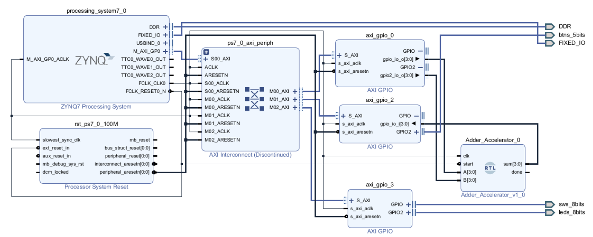

# simpleHardwareAccelerator

A simple 4-bit hardware adder accelerator implemented on the ZedBoard using Xilinx Vivado and Vitis.

## Overview

This project demonstrates the development and integration of a custom hardware accelerator with a Zynq-7000 SoC. A 4-bit adder is implemented as a custom IP core in the Programmable Logic (PL) and interfaced with the ARM Processing System (PS) using AXI-Lite. Users input values using the ZedBoard’s switches, and the computed result is displayed on the onboard LEDs.

Created as part of our **Hardware-Software Codesign Class**  
**By Ryan Massie, Teagan Hendricks, Ben Starling**

---

## ✨ Objectives

- Design and implement a 4-bit adder as a custom hardware IP.
- Interface the hardware with the Zynq Processing System via AXI-Lite.
- Handle I/O through AXI GPIO for reading switches and driving LEDs.
- Gain hands-on experience with hardware/software co-design.

---

## 🧠 Background

The Zynq-7000 SoC integrates a dual-core ARM Cortex-A9 with programmable logic, making it ideal for hardware/software co-design. In this lab:

- A 4-bit adder IP is created in VHDL.
- The accelerator connects to the PS via AXI-Lite.
- AXI GPIO handles inputs (switches) and outputs (LEDs).
- A Vitis application sends switch data to the accelerator and receives the result.

This approach allows rapid computation offloading from software to hardware and offers insights into embedded accelerator design.

---

## 🛠️ Materials Required

- ZedBoard (Zynq-7000 SoC)
- Micro-USB cable (power/UART)
- Vivado Design Suite 2020.2+
- Vitis Unified Software Platform
- Ethernet cable (optional)
- Host PC with required software
- Provided Vivado/Vitis project files

---

## 🧱 Project Structure

### Part 1: Vivado – Hardware Design

1. Open the provided Vivado project.
2. Verify inclusion of:
   - `adder.vhdl` (custom IP)
   - `zedboard_constraints.xdc`
3. Open and inspect the block design:
   - Zynq PS
   - Custom Adder IP
   - AXI GPIO (for switches/LEDs)
   - AXI Interconnect
4. Run block automation, generate HDL wrapper.
5. Synthesize, implement, and generate the bitstream.
6. Export hardware for Vitis development (`.xsa` file).

  
*Vivado block diagram showing custom adder IP integration*

### Part 2: Vitis – Software Development

1. Open Vitis and create a new application project using the exported `.xsa`.
2. Replace `main.c` with the provided C source code.
3. Build the project to generate the executable.

### Part 3: Testing on Hardware

1. Set input A (SW0–SW3) and input B (SW4–SW7).
2. The PS reads these inputs and sends them to the hardware adder.
3. Result (A + B) is shown on LEDs LD0–LD3.
4. Test various inputs (e.g., A = `0x03`, B = `0x02` → Output = `0x05`).

> **Note:** Output is limited to 4 bits (modulo 16). Overflow is not indicated.

---

## 🧰 Troubleshooting Tips

- Only the lower 4 LEDs are used for the sum.
- Ensure correct constraint files are in place.
- Re-check Vivado/Vitis project setup if errors occur.
- Make sure switches are toggled firmly before reset/test.

---
